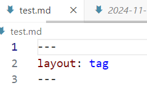
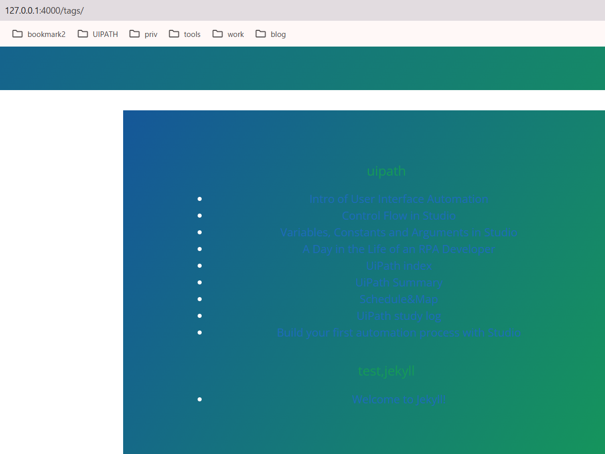

# 被tags折磨的日子

## <24/11/15>
- 可以出

- 不行

---
- 成功了，但不完全成功= =

-
PS C:\Users\Liu> cd D:\Liu\blog\ukibune.github.io
PS D:\Liu\blog\ukibune.github.io> bundle exec jekyll serve
http://127.0.0.1:4000/tags/

http://127.0.0.1:4000//

---

- 成功了！给ruby磕头

---
  <ul>
    
      <h2>{{ tag }}</h2>
          
              
                <li>
                  <a href="{{ post.url }}">{{ post.title }}</a>
                </li>
              
          
    
  </ul>
---