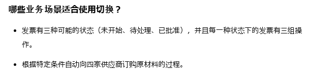

# Variables, Constants and Arguments in Studio

[CN](https://cloud.uipath.com/meisen/academy_/courses/studio-%E4%B8%AD%E7%9A%84%E5%8F%98%E9%87%8F%E5%92%8C%E5%8F%82%E6%95%B0)
//
[EN](https://cloud.uipath.com/meisen/academy_/courses/variables-constants-and-arguments-in-studio)

## 变量
-
  有些创造变量的方法在新版本中已经不适用了。
  - 不能在Sequence里右键面板或快捷键添加变量，要在输入框里快捷键，或者扩展面板选。 优：自动分配scope（sequence）
-
   Set var: status \
   也不适用好吧！
   在输入框里用 `ctrl +k` 可以出 （`ctrl +k`引数 `Ctrl + Shift + M` out 引数）
   \
   日语版本不识别英文指令？？？

-
  这四个方法是对的啊，是我视频听岔了？
  

## 目標（参数）

 

### 工作流

 

- ステート マシン
- グローバル例外ハンドラー

### 和变量的区别
 区别在于参数是在工作流之间传递数据，并且具有附加属性 – **方向**。参数具有特定的方向：In、Out 以及 In/Out。这些方向会告知 Robot 其中存储的信息应前往何处。

 - 找不到mscorlib所以用了这个
 - 

>结束，明天学数组！
---

## 数组

- 数组是最常见的具有固定大小（即创建时的大小）的集合示例。
- 

## 练习

- 做了工作流的练习后才发现对变数引数的理解不对！

  - 主界面 放用户输入框 结果输出框
  - 计算内容打包 invoke （此处连接Variables and Arguments）
  - invoke 放单独的sequence里
  - 主界面设置Variables
  - 工作流设置Arguments
  - 年利率 固定变量 在工作流中设置default

    **！目标实现，但写得像坨💩也是不行的！**

---
## 习题

- 
    > ？？？？？ 我学过这个知识点吗？