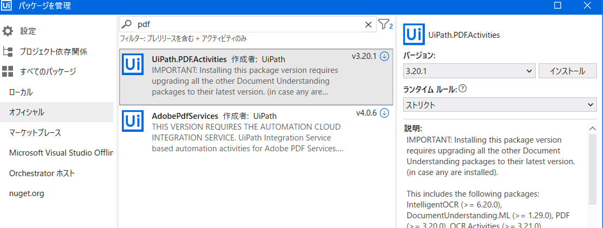
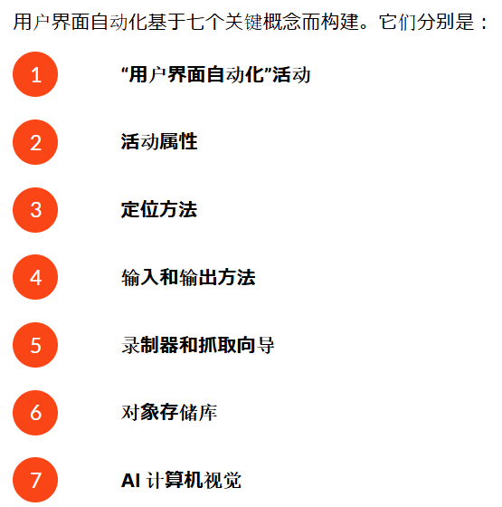
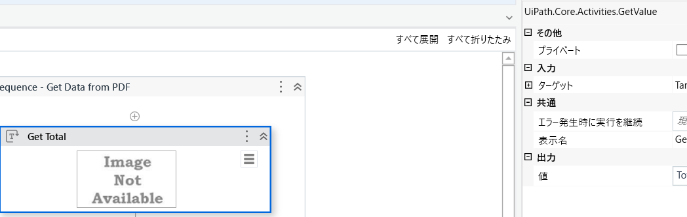
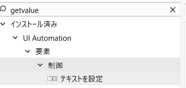
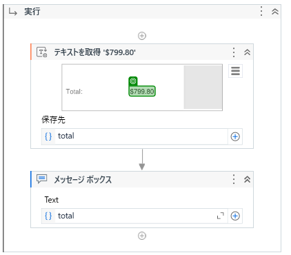
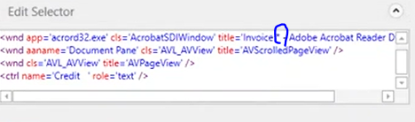

  

  

别人也找不到 = = 而且帖子内没被解决。
[screen-scraper](https://forum.uipath.com/t/how-can-i-install-or-locate-screen-scraper/304843)

版本不同真的很烦，这个叫GetValue

---

## 可行（新version）
  
中

---
使用通配符，使其能处理不同文件
